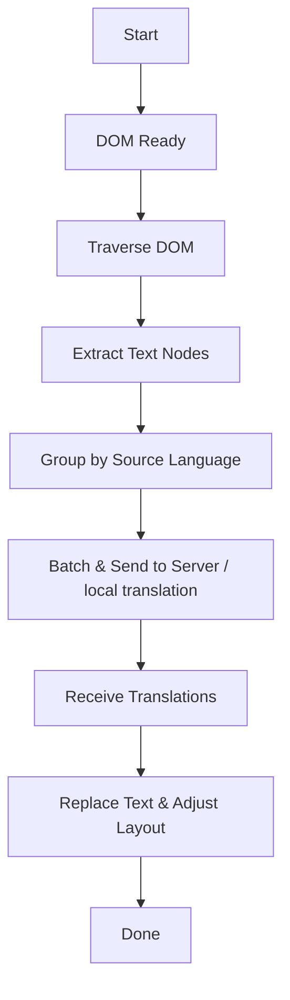
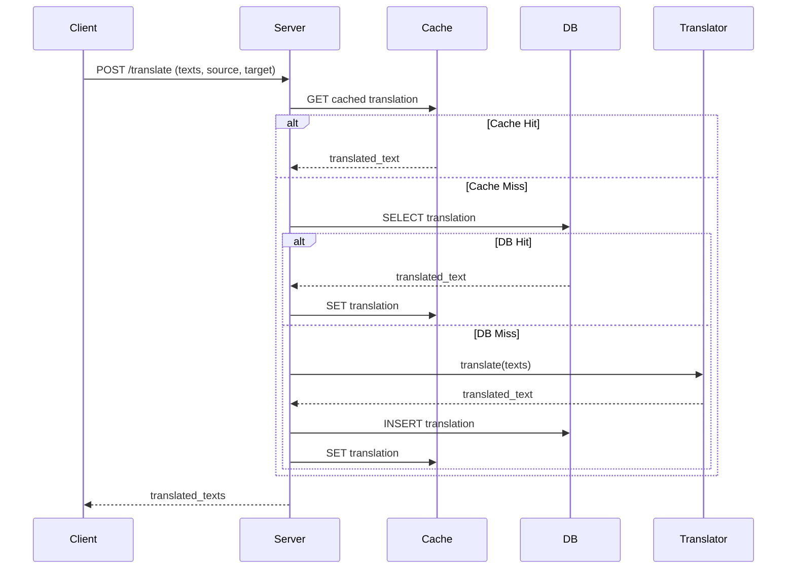

# Architecture

The RunFix Container project consists of two main components:

- **Client Library (`@runfix/container`)**  
  - Purpose: Traverses the DOM at runtime, extracts visible text nodes, sends batched translation requests, replaces text, and adjusts layout to prevent overflow by group-scaling font sizes.
  - Implementation: Browser-compatible TypeScript package, published via npm and available via CDN.

- **Remote Translation Server**  
  - Purpose: Exposes REST APIs for translation management, caching, and persistence, fully compatible with the client library.
  - Tech Stack:
    - Runtime: Bun
    - Framework: Elysia.js
    - Database: PostgreSQL (Prisma ORM)
    - Cache: Redis
    - Translator: Pluggable (default via OpenAI)
  - Deployment: Hosted on Coolify VPS (4× Intel Xeon E5-2680 v2, 4GB RAM) with horizontal scaling across multiple instances and round‑robin load balancing.

## Client Library Flow

## Server Sequence

## Deployment

- **Server:** Hosted via Coolify on a shared VPS in NY, with horizontally scaled Elysia.js instances.
- **Client:** Published as an npm package and served via CDN.

## Server ERD

